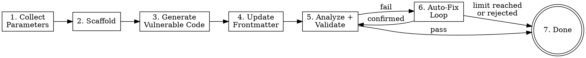

Create a new wxl challenge — from parameter collection through scaffolding, vulnerable code generation, metadata update, and validation with auto-fix.

**Input**: The argument after `/wxl-creator` is an optional free-text description of the challenge to create. Examples:

- `/wxl-creator` (no arguments — will ask everything interactively)
- `/wxl-creator 建一個 flask 的 SQLi 題目叫 login-bypass`
- `/wxl-creator name: xss-form, backend: fastapi, vuln: reflected XSS, difficulty: medium`

**Workflow overview:**



---

**Steps**

1. **Collect parameters**

   First, scan the user's initial message (the argument after `/wxl-creator`) and extract any parameters already provided. Parameters to collect:

   | Parameter | Key | Required | Default |
   |-----------|-----|----------|---------|
   | Challenge name (slug) | `slug` | Yes | — |
   | Backend type | `backend` | Yes | — |
   | Vulnerability type | `vuln` | Yes | — |
   | Challenge description | `description` | Yes | — |
   | Difficulty | `difficulty` | Yes | — |
   | Flag | `flag` | No | `FLAG{<slug>_<random8hex>}` |
   | Title | `title` | No | Slug → Title Case |

   For each parameter NOT already provided, use the **AskUserQuestion tool** to ask. Group questions into rounds — skip entire rounds if all parameters in that round are already extracted:

   **Round 1 (required):**
   - slug: Ask for the challenge name. Validate: must be kebab-case (`/^[a-z0-9]([a-z0-9-]*[a-z0-9])?$/`). If invalid, explain and re-ask.
   - backend: Use AskUserQuestion with options: `flask`, `fastapi`, `php`
   - vuln: Ask for vulnerability type as free text (e.g., SQLi, XSS, SSRF, LFI, RCE, XXE, SSTI, IDOR, etc.)

   **Round 2 (content):**
   - description: Ask for a scenario narrative describing the challenge. This is what you will use to generate the vulnerable code.
   - difficulty: Use AskUserQuestion with options: `easy`, `medium`, `hard`

   **Round 3 (optional with defaults):**
   - flag: Show the default format `FLAG{<slug>_<random8hex>}` and ask if user wants to customize. If user accepts, auto-generate later.
   - title: Show the default (slug converted to Title Case) and ask if user wants to customize.

   After collecting all parameters, display a summary:
   ```
   📋 Challenge 參數確認：
     Name:       <slug>
     Backend:    <backend>
     Vuln Type:  <vuln>
     Difficulty: <difficulty>
     Flag:       <flag or "auto-generate">
     Title:      <title>
     Description: <description>
   ```

   Use **AskUserQuestion tool** to confirm: "確認建立？" with options "確認" / "修改參數"。If user wants to modify, re-ask the specific parameter.

2. **Scaffold**

   Run the scaffold command via Bash:

   ```bash
   pnpm create:challenge --name "<slug>" --backend "<backend>" --difficulty "<difficulty>" --flag "<flag>" --title "<title>"
   ```

   If `flag` was set to auto-generate, omit the `--flag` argument (the script generates one automatically).

   **If exit code is 0**: Report success and proceed to step 3.

   **If exit code is 1 (collision)**: Display the error message. Use **AskUserQuestion tool** to ask:
   - "選擇不同名稱" — re-ask for slug, then re-run scaffold
   - "取消" — stop the workflow

   **If exit code is 1 (other error)**: Display the error and stop.

3. **Generate vulnerable application code**

   This is the core step. You SHALL read the scaffold skeleton and rewrite it with real, exploitable vulnerability code.

   a. **Read the skeleton file** using the Read tool:
      - Flask/FastAPI: `docs/challenge/<slug>/src/app.py`
      - PHP: `docs/challenge/<slug>/src/index.php`

   b. **Read the existing sqli-demo as reference** for code style and structure:
      - `docs/challenge/sqli-demo/src/app.py`

   c. **Write the vulnerable code** using the Write tool to overwrite the skeleton. The generated code SHALL:
      - Follow the same structure as the reference (docstring, imports, setup, HTML template, routes)
      - Read the flag from `/flag.txt` using `open("/flag.txt").read().strip()`
      - Contain a **real, exploitable** vulnerability matching the specified vuln type
      - NOT be trivially obvious (no bare `eval(user_input)` or `os.system(input())`)
      - Include HTML UI (forms, pages) for realistic attack surface
      - Have a clear exploitation path leading to flag retrieval
      - Include a comment marking the vulnerable line: `# Vulnerability: <brief explanation>`

   d. **Note package dependencies** needed by the vulnerability (e.g., `sqlite3` for SQLi). You will add them to frontmatter in step 4.

   **Backend-specific guidance:**
   - **Flask**: Use `from flask import Flask, request, Response`. Routes with `@app.route()`.
   - **FastAPI**: Use `from fastapi import FastAPI` and `from fastapi.responses import HTMLResponse`. Routes with `@app.get()` / `@app.post()`.
   - **PHP**: Standard PHP with `<?php` opening. Use `$_GET`/`$_POST` for input. Use `file_get_contents('/flag.txt')` for flag.

4. **Update frontmatter and description**

   Read `docs/challenge/<slug>/index.md` using the Read tool. Then use the Edit tool to update:

   a. **Add/update frontmatter fields:**
      - `description`: 1-2 sentence challenge description derived from the collected description
      - `tags`: Array of relevant tags — include vulnerability keywords and backend (e.g., `[sql, injection, flask, sqlite]`)
      - `source_visible: false`
      - `packages`: Array of additional Python packages if the vulnerability requires them (e.g., `[sqlite3]`). Leave as `[]` if none needed.

   b. **Replace the markdown body:** Replace `TODO: Write challenge description here.` with a brief challenge description (1-2 sentences describing the scenario and player's goal).

   **Do NOT modify**: `title`, `layout`, `difficulty`, `category`, `backend`, `app`, `date` — these were set correctly by the scaffold.

5. **Run analyze and validate**

   Run both commands via Bash, in order:

   ```bash
   pnpm challenge:analyze <slug>
   ```

   ```bash
   pnpm challenge:validate <slug>
   ```

   **If both exit with code 0 and no warnings in analyze output**: Display success. Go to step 7 (completion — success).

   **If either fails (non-zero exit) or analyze reports warnings**: Display the full output. Go to step 6 (auto-fix loop).

6. **Auto-fix loop**

   ```dot
   digraph fixloop {
       node [shape=box];
       start [label="Parse errors/warnings", shape=ellipse];
       check_limit [label="attempts < max?", shape=diamond];
       fix [label="Propose fixes"];
       show_diff [label="Show changes\nto user"];
       confirm [label="User confirms?", shape=diamond];
       apply [label="Apply fixes"];
       revalidate [label="Re-run analyze\n+ validate"];
       pass [label="All pass?", shape=diamond];
       done [label="→ Step 7\n(success)", shape=doublecircle];
       stop_limit [label="→ Step 7\n(with errors)"];
       stop_reject [label="→ Step 7\n(with errors)"];

       start -> check_limit;
       check_limit -> fix [label="yes"];
       check_limit -> stop_limit [label="no"];
       fix -> show_diff;
       show_diff -> confirm;
       confirm -> apply [label="yes"];
       confirm -> stop_reject [label="no"];
       apply -> revalidate;
       revalidate -> pass;
       pass -> done [label="yes"];
       pass -> start [label="no"];
   }
   ```

   **Reading the config:** At the start of this step, read `.wxl-creator/config.yaml` using the Read tool. Parse the YAML to extract `max_fix_attempts`. If the file does not exist or has no such field, use the default value of **10**. Initialize `attempt = 0`.

   **Each iteration:**

   a. Increment `attempt`. If `attempt > max_fix_attempts`, display:
      ```
      已達到自動修正上限（<max> 次）。以下問題需要手動處理：
      - <remaining errors/warnings>
      可在 .wxl-creator/config.yaml 調整 max_fix_attempts。
      ```
      Go to step 7 (completion — with errors).

   b. **Parse** the error/warning output from the previous analyze/validate run. Identify all issues.

   c. **Propose fixes** — address ALL identified issues in a single attempt:
      - Missing/invalid frontmatter fields → add or correct them using Edit tool
      - Wrong file type for backend → fix the mismatch
      - Flag format not matching `FLAG{...}` or `CTF{...}` → rewrite flag.txt
      - Hardcoded `localhost`/`127.0.0.1`/`0.0.0.0` in app code → remove or replace
      - Missing files → create them using Write tool

   d. **Before applying**, describe ALL proposed changes to the user. Show what will change and why.

   e. Use **AskUserQuestion tool** to ask: "套用這些修正？" with options:
      - "套用" — apply the fixes
      - "跳過，顯示剩餘錯誤" — stop the loop, go to step 7 (with errors)

   f. **If user confirms**: Apply all fixes (Edit/Write tools). Then re-run both commands:
      ```bash
      pnpm challenge:analyze <slug>
      pnpm challenge:validate <slug>
      ```
      If both pass → go to step 7 (success). If not → loop back to (a).

   g. **If user rejects**: Display remaining errors. Go to step 7 (completion — with errors).

7. **Completion**

   **On success (all checks passed):**
   ```
   ✓ Challenge "<slug>" 建立完成！

   檔案結構：
     docs/challenge/<slug>/index.md
     docs/challenge/<slug>/src/<app-file>
     docs/challenge/<slug>/src/flag.txt

   Analyze: ✓ 通過
   Validate: ✓ 通過

   可使用 pnpm docs:dev 預覽，或繼續建立下一個題目。
   ```

   **On failure (errors remain):**
   ```
   ⚠ Challenge "<slug>" 已建立但有未解決的問題：
   <list remaining errors/warnings>

   請手動修正後執行：
     pnpm challenge:validate <slug>
     pnpm challenge:analyze <slug>
   ```

---

**Guardrails**

- You SHALL NOT skip any step. Follow the workflow in order.
- You SHALL NOT generate trivially obvious vulnerabilities (e.g., bare `eval()`, `os.system(input())`).
- You SHALL always read the scaffold skeleton before overwriting — never generate code from scratch without seeing the skeleton structure.
- You SHALL always read `sqli-demo/src/app.py` as a reference for code style before generating.
- You SHALL NOT modify existing scripts (`create-challenge.ts`, `challenge-validate.ts`, `challenge-analyze.ts`) — call them as-is.
- You SHALL always wait for user confirmation before applying auto-fixes.
- You SHALL track the fix loop counter and respect `max_fix_attempts`.
- If **AskUserQuestion tool** is not available, ask the same questions as plain text and wait for the user's response.

**Quick Reference**

| Command | Purpose |
|---------|---------|
| `pnpm create:challenge --name <slug> --backend <type>` | Scaffold + keygen |
| `pnpm challenge:analyze <slug>` | Content analysis + warnings |
| `pnpm challenge:validate <slug>` | Structure + frontmatter validation |

| Backend | App File | Language |
|---------|----------|----------|
| flask | `app.py` | Python |
| fastapi | `app.py` | Python |
| php | `index.php` | PHP |

**Common Mistakes to Avoid**

- Forgetting `source_visible: false` in frontmatter
- Flag not matching `FLAG{...}` or `CTF{...}` pattern
- Hardcoded `localhost` or `127.0.0.1` in app code — the app runs in WASM, not a real server
- Missing `packages` in frontmatter when vulnerability needs extra packages
- Skipping the confirmation step before applying auto-fixes
